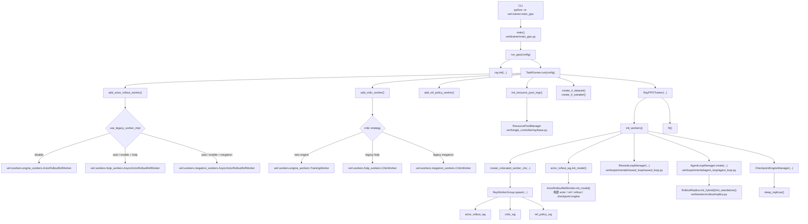
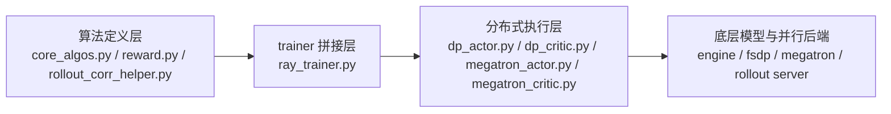

# verl 训练结构流程图

下面这份图按默认 PPO 主链路整理，主入口是 `python -m verl.trainer.main_ppo`。  
重点覆盖 4 层：

- 入口与配置装配
- `RayPPOTrainer.init_workers()` 的 worker / rollout / reward / checkpoint 组装
- `RayPPOTrainer.fit()` 的单步训练数据流
- 关键模块各自负责什么

> 备注
> - 默认配置里 `hybrid_engine: true`
> - `use_legacy_worker_impl: auto`，因此 actor / critic 具体落到 legacy worker 还是 new engine worker，要看策略和配置

## 1. 启动与模块装配

## 2. 单步训练数据流

```mermaid
flowchart TD
    A["RayPPOTrainer.fit()"] --> B["train_dataloader<br/>StatefulDataLoader"]
    B --> C["batch_dict -> DataProto"]
    C --> D["_get_gen_batch(batch)"]
    D --> E["async_rollout_manager.generate_sequences(...)"]

    E --> E1["AgentLoopManager.generate_sequences()"]
    E1 --> E2["AgentLoopWorker.generate_sequences()"]
    E2 --> E3["RolloutReplica server<br/>vLLM / SGLang / TRTLLM"]
    E3 --> F["gen_batch_output<br/>responses / rollout_log_probs / metadata"]

    F --> G["batch.repeat(n) + batch.union(gen_batch_output)"]
    G --> H["compute_response_mask() / _balance_batch()"]

    H --> I{"use reward model?"}
    I -->|yes| J["_compute_reward_colocate()"]
    J --> J1["RewardLoopManager.compute_rm_score()"]
    J1 --> J2["RewardLoopWorker.compute_score_batch()"]
    J2 --> J3["RewardModelManager / 自定义 reward manager"]
    I -->|no| K["extract_reward(batch)"]
    J3 --> K
    K --> L["reward_tensor + reward_extra_infos"]

    L --> M{"rollout correction bypass?"}
    M -->|no| N["_compute_old_log_prob(batch)"]
    N --> N1["actor_rollout_wg.compute_log_prob()"]
    M -->|yes| N2["apply_bypass_mode()"]

    N --> O{"need ref policy?"}
    N2 --> O
    O -->|yes| P["_compute_ref_log_prob(batch)"]
    P --> P1["ref_policy_wg.compute_ref_log_prob()<br/>或 actor_rollout_wg.compute_log_prob(no_lora_adapter)"]
    O -->|no| Q["跳过 ref"]

    P1 --> R{"need critic?"}
    Q --> R
    R -->|yes| S["_compute_values(batch)"]
    S --> S1["critic_wg.compute_values()<br/>或 critic_wg.infer_batch()"]
    R -->|no| T["跳过 values"]

    S1 --> U["extract_reward()"]
    T --> U
    U --> V["apply_kl_penalty() / token_level_rewards"]
    V --> W["compute_advantage()<br/>GAE / GRPO / REINFORCE++ / GDPO ..."]

    W --> X{"use critic?"}
    X -->|yes| Y["_update_critic(batch)"]
    Y --> Y1["critic_wg.update_critic()<br/>或 critic_wg.train_mini_batch()"]
    X -->|no| Z["跳过 critic update"]

    Y1 --> AA{"critic warmup finished?"}
    Z --> AA
    AA -->|yes| AB["_update_actor(batch)"]
    AB --> AB1["actor_rollout_wg.update_actor()<br/>或 actor.train_mini_batch()"]
    AA -->|no| AC["只训 critic"]

    AB1 --> AD["_save_checkpoint()<br/>可选"]
    AC --> AE["validate / log"]
    AD --> AF["checkpoint_manager.update_weights(global_steps)"]
    AF --> AG["trainer weights -> rollout replicas"]
    AG --> AE["validate / log / next step"]
```

## 3. 关键模块职责

- `verl/trainer/main_ppo.py`
  - 负责 Hydra 配置入口、`ray.init()`、`TaskRunner.run()`、数据集和 sampler 创建。
- `verl/trainer/ppo/ray_trainer.py`
  - 训练总控。负责 `init_workers()`、`fit()`、reward/advantage 计算、actor/critic 更新、checkpoint 与验证。
- `verl/single_controller/ray/base.py`
  - 负责 `ResourcePoolManager`、`RayWorkerGroup`、`create_colocated_worker_cls()`，把多个 role 装进同一组 Ray actor / placement group。
- `verl/workers/engine_workers.py`
  - new engine 路径的核心实现。`ActorRolloutRefWorker.init_model()` 会在同一 worker 里拼出 actor、ref、rollout、checkpoint engine。
- `verl/workers/rollout/replica.py`
  - rollout server 抽象层。决定 rollout 是 `HYBRID`、`COLOCATED` 还是 `STANDALONE`。
- `verl/experimental/agent_loop/agent_loop.py`
  - 异步 rollout 调度层。负责创建 rollout replicas、agent loop workers、负载均衡，并把 batch 分发到各 rollout server。
- `verl/experimental/reward_loop/reward_loop.py`
  - reward loop 调度层。负责 reward worker 的分发，以及 reward model 的唤醒 / 休眠。
- `verl/trainer/ppo/reward.py`
  - 把 reward manager 输出整理成训练用 `reward_tensor`，并抽取 `reward_extra_infos`。
- `verl/protocol.py`
  - `DataProto` 数据协议。训练各阶段基本都围绕 `batch.union(...)`、`chunk(...)`、`repeat(...)` 传递数据。

## 4. 一句话理解主链路

`main_ppo.py` 负责把配置、数据和 Ray 环境准备好；`ray_trainer.py` 负责把 actor / critic / ref / rollout / reward 这些模块拼成可调度系统；训练时 driver 进程每步取一个 prompt batch，先走 rollout 生成，再补 reward / logprob / value / advantage，最后触发 actor 和 critic 更新，并把新权重同步回 rollout 副本。

## 5. 算法设计时优先关注哪些模块

如果你的目标是“改算法”而不是“改分布式/工程框架”，可以把代码分成 3 层看：

### 5.1 `core_algos.py` 是算法核心

这里是最值得优先看的文件：

- `verl/trainer/ppo/core_algos.py`
  - `AdvantageEstimator` 和 `register_adv_est(...)`
  - `compute_gae_advantage_return(...)`
  - `compute_grpo_outcome_advantage(...)`
  - `compute_gdpo_outcome_advantage(...)`
  - 各种 `compute_policy_loss_*`
  - `compute_value_loss(...)`
  - `kl_penalty(...)`

这层定义的是“公式本身”，不关心 FSDP 还是 Megatron，也不关心 Ray 怎么调度。  
如果你要改：

- advantage 定义
- policy loss 形式
- KL 估计方式
- value loss 形式
- rollout correction / IS / rejection sampling 逻辑

优先改这里。

### 5.2 `ray_trainer.py` 是算法拼接点

- `verl/trainer/ppo/ray_trainer.py`
  - `apply_kl_penalty(...)`
  - `compute_advantage(...)`
  - `_compute_old_log_prob(...)`
  - `_compute_ref_log_prob(...)`
  - `_compute_values(...)`
  - `_update_actor(...)`
  - `_update_critic(...)`
  - `fit()`

这层决定的是“训练 step 里先后做什么、哪些张量被塞进 batch、哪些模块参与”。  
如果你要改：

- 先 rollout 再算什么
- reward / ref / critic 在 step 里如何接起来
- 新增一个算法分支需要什么输入张量
- actor update 前后要不要插额外处理

优先改这里。

### 5.3 `dp_actor.py` / `dp_critic.py` 是执行层，不是算法总控层

- `verl/workers/actor/dp_actor.py`
  - 负责 FSDP actor 上的 `compute_log_prob()` 和 `update_policy()`
  - 真正调用 `get_policy_loss_fn(loss_mode)` 去拿 `core_algos.py` 里的 loss
  - 再把 loss、entropy、kl、grad step 落到 micro-batch / mini-batch 上
- `verl/workers/critic/dp_critic.py`
  - 负责 `compute_values()` 和 `update_critic()`
  - 里面直接调用 `core_algos.compute_value_loss(...)`

所以：

- 改“公式”时，通常不要先改 `dp_actor.py`
- 改“FSDP actor 如何执行这个公式”时，才改 `dp_actor.py`
- 如果你同时支持 Megatron，还要同步看 `verl/workers/actor/megatron_actor.py`

### 5.4 new engine 路径会把算法调用再包一层

- `verl/workers/utils/losses.py`
  - `ppo_loss(...)`
  - `value_loss(...)`

当 `use_legacy_worker_impl=disable` 时，new engine 不直接走 `DataParallelPPOActor.update_policy()` 这条老路径，而是通过这两个 loss 包装函数调用同一套 `core_algos.py`。  
因此如果你想做“尽量同时兼容 old worker 和 new engine”的算法改动：

- 优先改 `core_algos.py`
- 必要时补 `ray_trainer.py`
- 然后检查 `workers/utils/losses.py` 是否也需要喂入新的字段

## 6. 按改动类型找文件

- 改 advantage estimator：
  - 先看 `verl/trainer/ppo/core_algos.py`
  - 再看 `verl/trainer/ppo/ray_trainer.py` 里的 `compute_advantage(...)`
- 改 PPO / GRPO / REINFORCE / bypass mode policy loss：
  - 先看 `verl/trainer/ppo/core_algos.py`
  - 再看 `verl/workers/actor/dp_actor.py`
  - new engine 还要看 `verl/workers/utils/losses.py`
- 改 reward 聚合方式或 reward manager：
  - 先看 `verl/trainer/ppo/reward.py`
  - 再看 `verl/experimental/reward_loop/reward_loop.py`
  - 具体 reward manager 在 `verl/experimental/reward_loop/reward_manager/`
- 改 rollout correction / IS / rejection sampling：
  - 先看 `verl/trainer/ppo/rollout_corr_helper.py`
  - 再看 `verl/trainer/ppo/core_algos.py` 里的 `compute_policy_loss_bypass_mode(...)`
- 改 critic loss：
  - 先看 `verl/trainer/ppo/core_algos.py` 的 `compute_value_loss(...)`
  - 再看 `verl/workers/critic/dp_critic.py`
  - new engine 再看 `verl/workers/utils/losses.py`
- 改训练 step 编排：
  - 看 `verl/trainer/ppo/ray_trainer.py`

## 7. 最实用的判断标准

你可以用下面这个判断：

- 想改“数学定义 / 优化目标 / estimator”：
  - 改 `core_algos.py`
- 想改“这个目标在训练 step 里接到哪里”：
  - 改 `ray_trainer.py`
- 想改“这个目标如何在 FSDP/Megatron micro-batch 上执行”：
  - 改 `dp_actor.py` / `dp_critic.py` / `megatron_actor.py` / `megatron_critic.py`
- 想改“reward 从哪来、怎么并行算”：
  - 改 `reward.py` + `reward_loop/`
